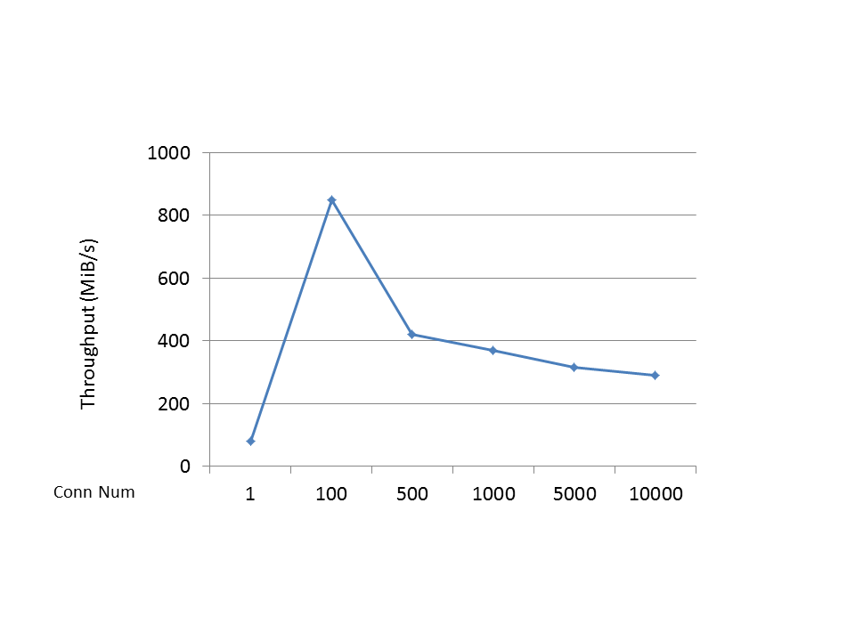
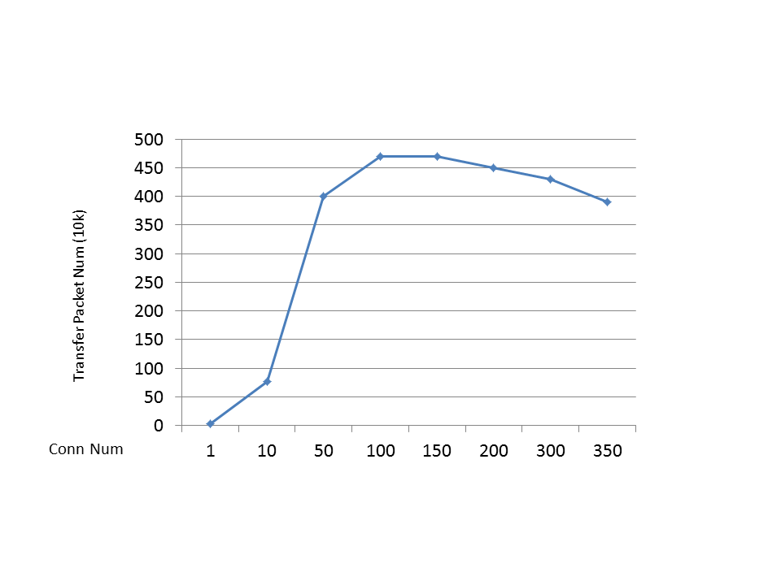

netxy
=======
Cross platform high performance TCP network library and RPC library using C++ 11.

## Features
* Cross platform (Linux | Windows)
* High performance and safety use.
* None depend
* Multi-threaded
* SSL support
* Support HTTP、HTTPS、WebSocket protocol
* IPv6 support
* RPC Library


## Benchamrk
   Under localhost, use CentOS 6.5 virtual mahcine(host machine is Win10 i5)
* PingPong

  Benchamrk's server and client both only use one thread, and packet size is 4k

  

* Broadcast

  Server use two network threads and one logic thread, client use one network(also process logic) thread. every packet size is 46 bytes.
  every packet contain client's id.
  server broadcast packet to all client when recv one packet from any client.
  client send one packet when recv packet from server and packet's id equal self.

  

* Ab HTTP(1 network thread)
        Document Path:          /
        Document Length:        18 bytes

        Concurrency Level:      100
        Time taken for tests:   5.871 seconds
        Complete requests:      100000
        Failed requests:        0
        Write errors:           0
        Non-2xx responses:      100000
        Total transferred:      5200000 bytes
        HTML transferred:       1800000 bytes
        Requests per second:    17031.62 [#/sec] (mean)
        Time per request:       5.871 [ms] (mean)
        Time per request:       0.059 [ms] (mean, across all concurrent requests)
        Transfer rate:          864.89 [Kbytes/sec] received

        Connection Times (ms)
                    min  mean[+/-sd] median   max
        Connect:        0    2   0.7      2       8
        Processing:     1    3   0.7      3       9
        Waiting:        0    3   0.8      3       8
        Total:          2    6   0.8      6      11

        Percentage of the requests served within a certain time (ms)
        50%      6
        66%      6
        75%      6
        80%      6
        90%      7
        95%      7
        98%      7
        99%      8
        100%     11 (longest request)

## About session safety
  This library use three layer ident one session(also is three way to use this library).
  * First, use raw pointer named DataSocket,combine with EventLoop in used that wrapper DataSocket of first layer
  * Second, use int64_t number ident one session, used in some callback of TCPService that wrapper DataSocket of first layer
  * Thrid, use smart pointer named TCPSession::PTR combine with WrapServer , you can control session by TCPSession::PTR

I suggest you use the second or thrid way above, because don't worry memory manager

## About RPC
  Use this RPC library, you not need any proto file sush as Protobuf and Thrift, because i use C++ Template Generic Programming do this work.
  
  The RPC support any C++ base type, sush as int、string、vector、map, and support Protobuf Message Type; Of course, RPC can use async callback mode, when you need process RPC reply msg return from server.
  
  On server side:
```cpp
static int add(int a, int b)
{
    return a + b;
}

static void addNoneRet(int a, int b, netxy::rpc::RpcRequestInfo reqInfo)
{
    // send reply when other async call completed
    /*
        auto caller = RpcServer::getRpcFromer();
        redis->get("k", [caller, reqInfo](const std::string& value){
            caller->reply(reqInfo, value);
        });
    */
}

void registerServices()
{
    RpcServer::def("add", add);
    RpcServer::def("add", addNoneRet);
}
```

On client side:

```cpp
rpcClient->call("add", 1, 2);
rpcClient->call("add", 1, 2, [](int result) {
    cout << result << endl;
});
```

Examples
----------------------------
* [PingPongServer](https://github.com/Kakarotto9/netxy/blob/master/examples/PingPongServer.cpp)
* [PingPongClient](https://github.com/Kakarotto9/netxy/blob/master/examples/PingPongClient.cpp)
* [BroadCastServer](https://github.com/Kakarotto9/netxy/blob/master/examples/BroadCastServer.cpp)
* [BroadCastClient](https://github.com/Kakarotto9/netxy/blob/master/examples/BroadCastClient.cpp)
* [SimpleHttpServer](https://github.com/Kakarotto9/netxy/blob/master/examples/TestHttp.cpp) show how to start http service and request http
* [BenchWebsocket](https://github.com/Kakarotto9/netxy/blob/master/examples/BenchWebsocket.cpp) benchmark websocket server
* [WebSocketProxy](https://github.com/Kakarotto9/netxy/blob/master/examples/WebBinaryProxy.cpp) one proxy server between websocket client and binary protocol server
* [SimpleRpcServer](https://github.com/Kakarotto9/netxy/blob/master/examples/SimpleRpcServer.cpp) rpc server use http and protobuf
* more examples please see [examples](https://github.com/Kakarotto9/netxy/tree/master/examples);
